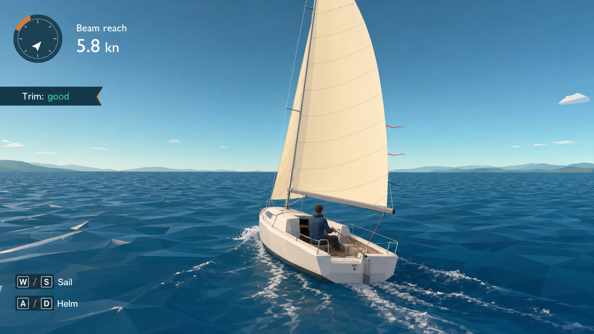

# Sailing Simulator

A focused browser game for learning the first principles of sailing on a lake
large enough to feel like open water.

The first repository slice is deliberately a **physics lab**, not a claim that
the finished 3D game already exists. It proves the interaction we care about:
steer, sheet in or ease out, watch the apparent wind, see the sail luff or
stall, find attached flow, and tack through the no-go zone.



## The product in one sentence

Give a new sailor one responsive boat, readable wind, a physically coherent
sail, and a huge beautiful lake—then let understanding emerge from the boat's
behavior.

## Why this is the easiest credible approach

- Build for the browser with Vite, TypeScript, and Three.js/WebGL.
- Simulate only planar surge, sway, and yaw; derive heel and wave motion for
  believable feedback instead of starting with full six-degree rigid-body CFD.
- Keep a deterministic fixed-step physics module separate from rendering.
- Use apparent wind and lift/drag curves for the sail, strong lateral keel
  resistance, water-flow rudder force, and quadratic hull drag.
- Render a camera-centered analytic wave surface and sample the same function
  on the CPU for boat motion.
- Start with a 10 km × 10 km lake. At 5–8 knots, a full crossing takes roughly
  40–65 minutes; atmospheric haze and a low eye height hide most shorelines
  from the central basin.
- Teach four things before adding more systems: wind direction, trim/luffing,
  points of sail, and tacking.

## Run the physics lab

```powershell
npm install
npm run dev
```

Controls: `A/D` or arrow keys steer, `W` eases the sheet, `S` sheets in, and
`R` resets. The lab uses a top-down diagnostic view so the force model can be
tuned before it is coupled to expensive 3D art.

## Project map

- [Saltwind analysis](docs/research/saltwind-analysis.md)
- [Game and learning design](docs/game-design.md)
- [Physics model](docs/physics-model.md)
- [Technical architecture and delivery plan](docs/architecture.md)
- [Master build prompt](docs/MASTER_PROMPT.md)
- [Ten visual mockups](docs/mockups/README.md)

## Product guardrails

The first release has one boat, one mainsail, one lake, changing wind, four
short lessons, and free sail. It does not have boost mechanics, multiplayer,
combat, trading, survival meters, or multiple boat classes.

## Reference and originality

[Saltwind](https://cdn.openai.com/ctf-cdn/sites/saltwind-game/index.html) was
studied as an observable browser reference. No Saltwind code, textures, names,
or other assets are included here. The implementation and generated mockups in
this repository are original.
