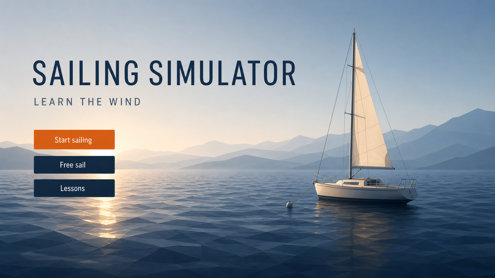
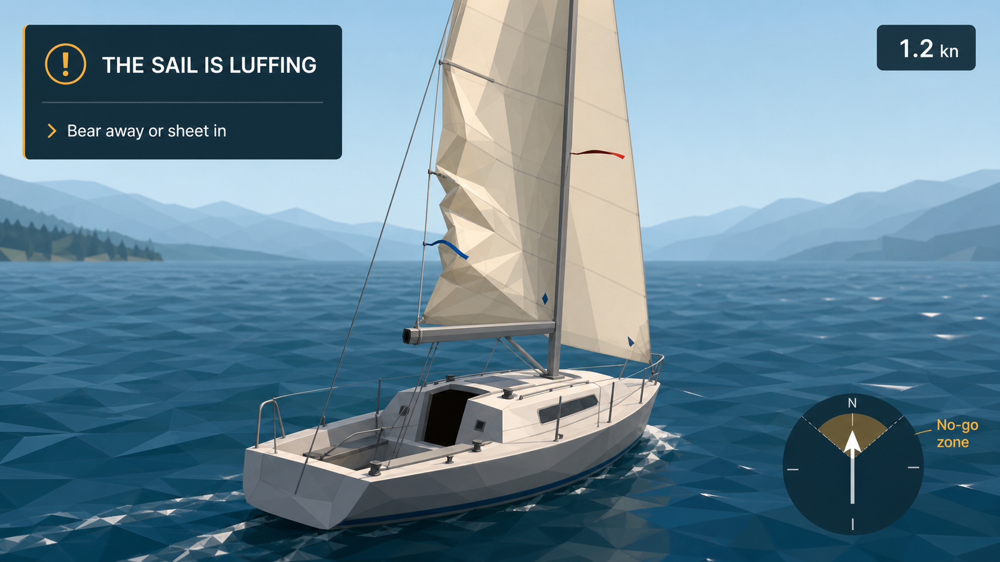
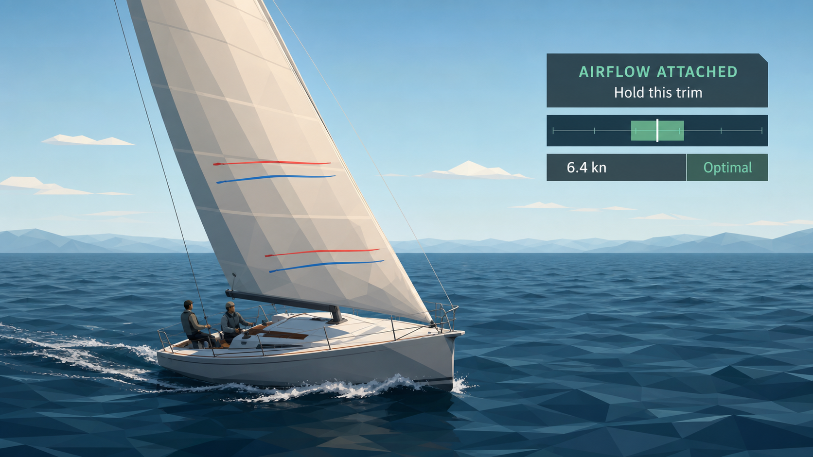
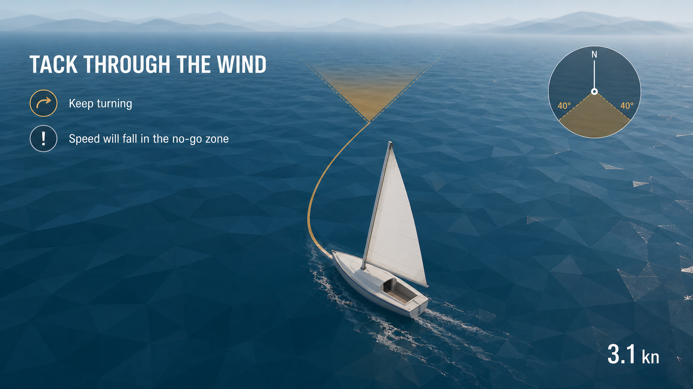
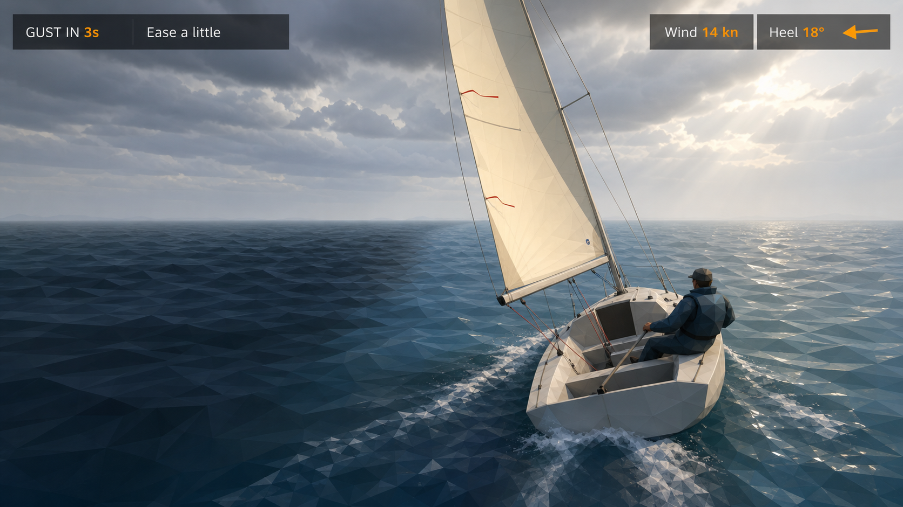
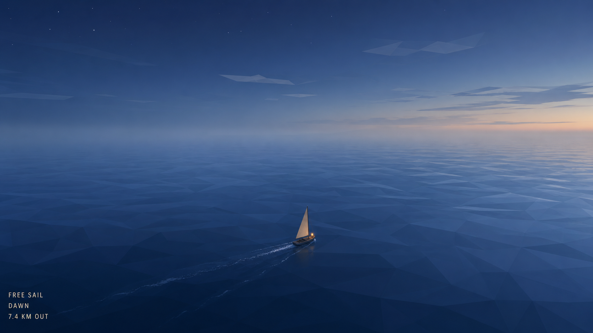
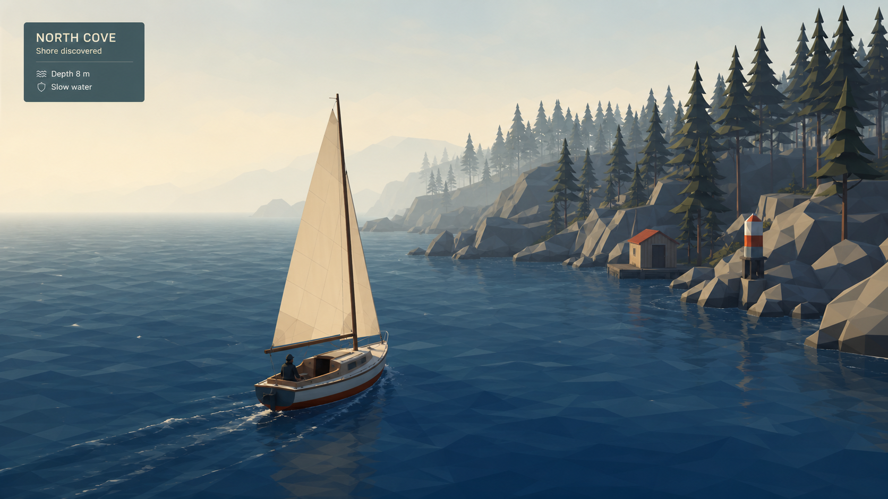
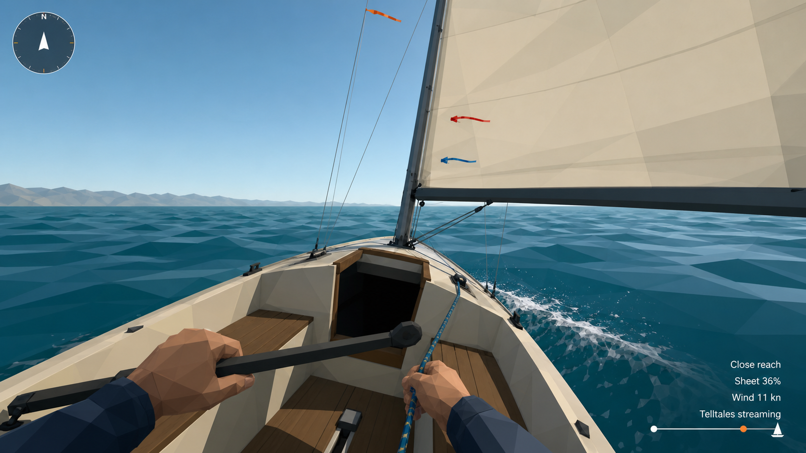
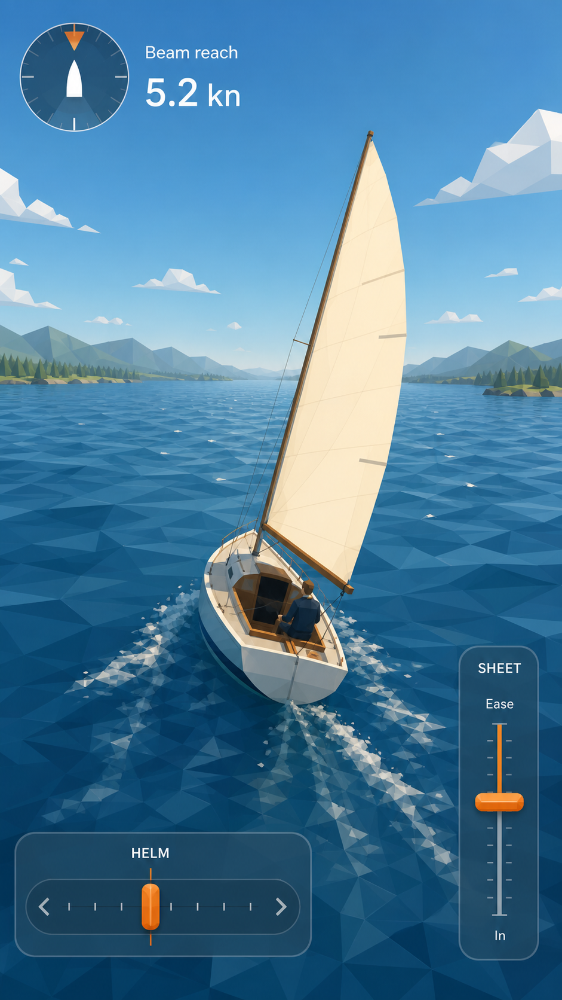

# Visual mockups

These ten AI-generated screens define composition, hierarchy, feedback, and the
[quiet-geometric art direction](../art-direction.md). They are references for
implementation, not textures to paste into the game.

The water invariant is shared across the full set: one coherent triangulated
surface with gentle vertex waves, flat face normals, restrained per-face blue
variation, and localized wake foam. It is never a tiled polygon collage.

| | |
| --- | --- |
| **01 · Launch screen** Small boat, immense lake, three choices, one accent.   | **02 · Core gameplay** Chase camera, readable sail, minimal instruments.   |
| **03 · Luffing lesson** Leading-edge flutter, wandering telltales, speed loss.   | **04 · Optimal trim** Stable camber, streaming telltales, attached flow.   |
| **05 · Tack lesson** No-go wedge, speed loss, calm curved-path guidance.   | **06 · Gust response** Dark water band, increased heel, ease prompt.   |
| **07 · Open-water exploration** Near-empty horizon and the boat at true world scale.   | **08 · Shore discovery** A restrained reward after a long crossing.   |
| **09 · Cockpit view** Optional first-person learning view with physical cues.   | **10 · Mobile controls** Spring-centered helm, persistent sheet slider, same quiet HUD.   |

See [prompts.md](prompts.md) for the reusable prompt system and each screen's
content brief.
